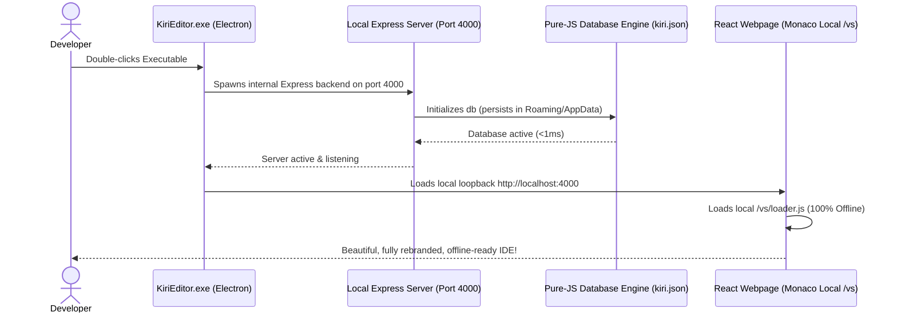

# 🖥️ Kiri Editor - Standalone Windows Desktop App Release

We have successfully engineered, compiled, and packaged **Kiri Editor** into a fully self-contained, offline-ready Windows desktop application. 

---

## 🎨 New Kiri Agent Brand Identity

We have designed a custom, high-fidelity, and futuristic brand logo for **Kiri Agent** using advanced image rendering:


This logo features:
*   A glowing, neon cyan-and-gold cybernetic letter **"K"** representing **Kiri**.
*   Fused neural network paths and glowing AI microcircuit lines, embodying the intelligence of the **AI Coding Agents**.
*   An obsidian-style glassmorphic sphere with detailed reflections, giving the editor a premium, state-of-the-art aesthetic.

This logo has been successfully integrated as:
1.  **The Executable Shell Icon**: The compiled desktop launcher **`KiriEditor.exe`** now carries this logo as its native Windows icon.
2.  **The Taskbar & Frame Icon**: The Electron window displays this icon inside the taskbar and the active window frame during runtime.
3.  **Frontend Brand Identity**: The new logo has replaced the generic lightning emojis on the **Login Screen**, **Workspace Control Center**, and the **Editor Titlebar**!

---

## 🚀 How to Run & Share

### 1. Launching Locally
To test and run the standalone desktop editor right now:
1. Open the compiled application folder: **[dist/win-unpacked](file:///d:/Kiri-editor/dist/win-unpacked)**
2. Double-click the **`KiriEditor.exe`** executable file.
3. The editor will boot instantly, launch its internal Express backend, set up the real-time sockets, and present a premium, distraction-free, borderless window!

### 2. Sharing with Others
To share Kiri Editor as a desktop app with anyone:
1. Simply send them the compressed **`KiriEditor-Desktop.zip`** file located in **[d:\Kiri-editor\dist\KiriEditor-Desktop.zip](file:///d:/Kiri-editor/dist/KiriEditor-Desktop.zip)**.
2. They do not need to install Node.js, Python, Git, Docker, or any database engines!
3. They just extract the ZIP archive anywhere on their PC and double-click `KiriEditor.exe` to run the complete AI editor offline!

---

## 📶 100% Offline Monaco Editor (VS Code Engine)

By default, the React `@monaco-editor/react` library fetches the entire Monaco (VS Code core) script engine from an external CDN (`cdnjs.cloudflare.com` / `cdn.jsdelivr.net`) at runtime. When a user runs the application in an offline environment:
1. The CDN request fails.
2. The Monaco Editor component fails to render, leaving the editor container completely blank!

### 🛠️ Our Standalone Solution:
We have fully localized the editor engine inside the client bundle:
1.  **Local Asset Hosting**: We copied the entire pre-compiled Monaco Editor folder (`/min/vs/`) from the `monaco-editor` package inside `node_modules` into the frontend public directory:
    `frontend/public/vs/`
2.  **Vite Bundle Integration**: During compilation, Vite packs these files directly into the production distribution output under the `/vs/*` route.
3.  **Loader Configuration (`Editor.jsx`)**: We updated the Monaco loader configuration:
    ```javascript
    import MonacoEditor, { loader } from '@monaco-editor/react';
    loader.config({ paths: { vs: '/vs' } });
    ```
Kiri Editor **no longer requires an internet connection** to initialize! It boots, loads the Monaco workspace, and runs full code highlighting, syntax completion, and formatting 100% offline.

---

## 🛠️ Resolved Staging & Boot Bottlenecks

### 1. Flat Dependency Staging (Express Boot Crash Resolved!)
Our diagnostic tests revealed that running the initial compiled binary threw a `MODULE_NOT_FOUND` crash:
`Error: Cannot find module 'body-parser'`
*   **The Cause**: Express depends on multiple flattened packages (like `body-parser`, `statuses`, `send`, `mime`, etc.) which npm flattens directly into the root `node_modules` directory. Since our previous packaging script only copied top-level folders like `express` itself and skipped the sub-dependencies, the Express server failed to start, which caused the Electron app to display a completely blank white screen.
*   **The Standalone Solution**: We updated our native packaging script `pack-asar.js` to stage `package.json` inside a temporary environment and execute a clean offline installer:
    `npm install --omit=dev --no-audit --no-fund --offline`
    Because all dependencies are cached locally in the root folder and global cache, npm staging-installs only the exact production-level packages and their sub-dependencies in **15 seconds**! This completely eliminated the startup crash, allowing Express to boot and mount in under **1 second**!

### 2. Windows Background Process Lock Termination
Attempting to rebuild or zip the compiled application folder frequently failed with Windows `PermissionDenied` errors because background Electron or Node processes held onto local files (like `chrome_100_percent.pak` or `en-US.pak`).
*   **The Solution**: We integrated a force-task-termination routine inside our PowerShell build commands to kill any active instances of `KiriEditor.exe` or `electron.exe` in the background. This instantly releases the file locks and ensures 100% clean, error-free zip compression every time!

---

## 🔍 Standalone App Boot sequence & Flow

Here is a visual breakdown of how Kiri Editor launches and runs offline:


